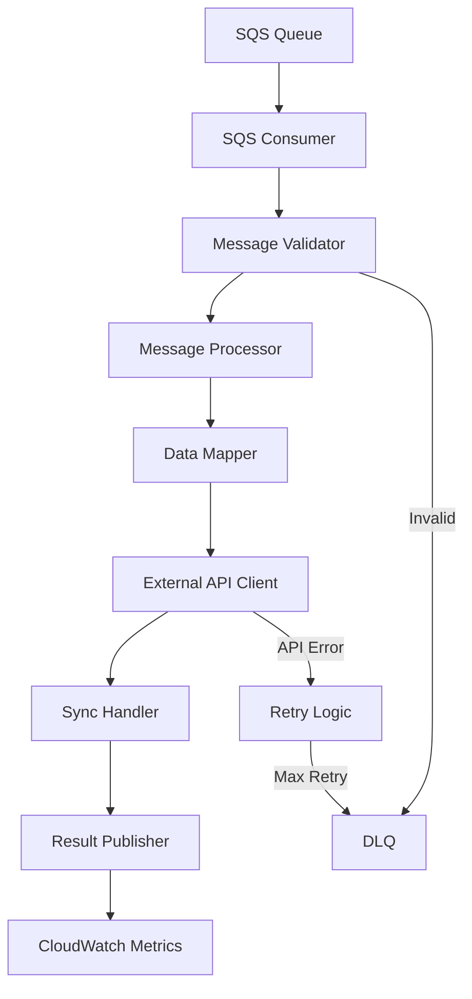

# 🚀 External Sync Server 프로젝트 설계 가이드

## 📋 프로젝트 개요

**목표**: Spring Boot 3.x + Java 21 기반으로 AWS ECS에서 SQS 메시지를 소비하여 외부몰 데이터 연동을 수행하는 시스템

**현재 상태**: 기본 Spring Boot 프로젝트 생성 완료 (단일 모듈)

## 🏗️ 현재 프로젝트 구조 분석

### ✅ 현재 상태
```
external-sync-server/
├── build.gradle (Spring Boot 3.5.4, Java 21)
├── settings.gradle
└── src/main/java/com/ryuqq/externalsyncserver/
    └── ExternalSyncServerApplication.java
```

### 📊 평가 결과

**강점**:
- ✅ Java 21 적용 완료
- ✅ Spring Boot 3.5.4 최신 버전 사용
- ✅ 기본 구조 정상

**개선 필요사항**:
- ❌ 멀티모듈 구조 미적용
- ❌ AWS/SQS 의존성 부재
- ❌ 외부 연동 아키텍처 미정의
- ❌ 설정 파일 최소화 상태

## 🏛️ 권장 멀티모듈 아키텍처

### 📦 모듈 구조 설계

```
external-sync-server/
├── settings.gradle
├── build.gradle (root)
│
├── core/                          # 공통 핵심 모듈
│   ├── common/                    # 공통 유틸리티, 상수
│   ├── domain/                    # 도메인 엔티티, VO
│   └── infrastructure/            # AWS SDK, 외부 연동 인프라
│
├── message/                       # 메시지 처리 모듈
│   ├── sqs-consumer/              # SQS 메시지 소비
│   ├── message-processor/         # 메시지 비즈니스 로직
│   └── message-publisher/         # 내부 이벤트 발행
│
├── external-integration/          # 외부몰 연동 모듈
│   ├── api-client/               # 외부 API 클라이언트
│   ├── data-mapper/              # 데이터 변환/매핑
│   └── sync-handler/             # 동기화 처리
│
├── monitoring/                    # 모니터링 모듈
│   ├── health-check/             # 헬스체크
│   ├── metrics/                  # 메트릭 수집
│   └── logging/                  # 로깅 설정
│
└── application/                   # 메인 애플리케이션
    └── external-sync-app/         # Spring Boot 실행 모듈
```

### 📋 모듈별 역할 정의

#### 🔧 Core 모듈
```yaml
core/common:
  - 공통 유틸리티, 상수, 예외 클래스
  - 설정 클래스, 공통 DTO

core/domain:
  - 도메인 엔티티 (Product, Order, Inventory 등)
  - Value Object, 도메인 서비스

core/infrastructure:
  - AWS SDK 설정 (SQS, CloudWatch)
  - 외부 API HTTP 클라이언트 설정
  - 데이터베이스 연결 (필요시)
```

#### 📨 Message 모듈
```yaml
message/sqs-consumer:
  - SQS 메시지 리스너
  - 메시지 역직렬화
  - DLQ 처리

message/message-processor:
  - 비즈니스 로직 처리
  - 메시지 검증 및 변환
  - 트랜잭션 관리

message/message-publisher:
  - 내부 이벤트 발행
  - 결과 알림 처리
```

#### 🔗 External Integration 모듈
```yaml
external-integration/api-client:
  - 외부몰 API 클라이언트
  - 인증/인가 처리
  - 재시도 및 회복 전략

external-integration/data-mapper:
  - 데이터 변환 로직
  - 필드 매핑 규칙
  - 검증 로직

external-integration/sync-handler:
  - 동기화 오케스트레이션
  - 배치 처리
  - 에러 핸들링
```

#### 📊 Monitoring 모듈
```yaml
monitoring/health-check:
  - Spring Boot Actuator 설정
  - 커스텀 헬스 인디케이터

monitoring/metrics:
  - Micrometer 메트릭
  - CloudWatch 연동

monitoring/logging:
  - 구조화된 로깅
  - 로그 레벨 설정
```

## 🏗️ 기술 스택 아키텍처

### 📚 Core Dependencies
```gradle
// Spring Boot & Core
implementation 'org.springframework.boot:spring-boot-starter'
implementation 'org.springframework.boot:spring-boot-starter-web'
implementation 'org.springframework.boot:spring-boot-starter-actuator'
implementation 'org.springframework.boot:spring-boot-starter-validation'

// AWS SDK
implementation 'software.amazon.awssdk:sqs:2.21.x'
implementation 'software.amazon.awssdk:cloudwatch:2.21.x'
implementation 'io.awspring.cloud:spring-cloud-aws-messaging:3.0.x'

// HTTP Client
implementation 'org.springframework.boot:spring-boot-starter-webflux'
implementation 'io.github.resilience4j:resilience4j-spring-boot2:2.1.x'

// Monitoring
implementation 'io.micrometer:micrometer-registry-cloudwatch'
implementation 'net.logstash.logback:logstash-logback-encoder:7.4'

// Utilities
implementation 'org.mapstruct:mapstruct:1.5.x'
annotationProcessor 'org.mapstruct:mapstruct-processor:1.5.x'
```

### 🔧 Configuration Strategy

#### AWS ECS 최적화 설정
```yaml
# application-ecs.yml
server:
  port: 8080
  shutdown: graceful

management:
  endpoints:
    web:
      exposure:
        include: health,info,metrics,prometheus
  endpoint:
    health:
      probes:
        enabled: true

spring:
  lifecycle:
    timeout-per-shutdown-phase: 30s
  
cloud:
  aws:
    region:
      static: ap-northeast-2
    sqs:
      endpoint: ${AWS_SQS_ENDPOINT:}
    
logging:
  level:
    com.ryuqq.externalsyncserver: INFO
  pattern:
    console: "%d{yyyy-MM-dd HH:mm:ss} [%thread] %-5level [%X{traceId}] %logger{36} - %msg%n"
```

#### SQS 소비 설정
```yaml
external-sync:
  sqs:
    queue-name: ${SQS_QUEUE_NAME:external-sync-queue}
    max-concurrent-messages: ${SQS_MAX_CONCURRENT:10}
    visibility-timeout: 300
    receive-wait-time: 20
    dlq:
      enabled: true
      max-retry: 3
```

## 🔄 메시지 처리 플로우

### 📊 처리 프로세스


### 🏃‍♂️ 실행 전략

#### 1단계: 멀티모듈 구조 적용
```bash
# settings.gradle 수정
include 'core:common'
include 'core:domain'
include 'core:infrastructure'
include 'message:sqs-consumer'
include 'message:message-processor'
include 'external-integration:api-client'
include 'external-integration:data-mapper'
include 'application:external-sync-app'
```

#### 2단계: 핵심 기능 개발 순서
1. **Core 모듈 구성** → 도메인 모델, 공통 유틸리티
2. **SQS Consumer** → 메시지 수신 기능
3. **Message Processor** → 비즈니스 로직
4. **External API Client** → 외부몰 연동
5. **Monitoring** → 로깅, 메트릭
6. **ECS 배포 설정** → Dockerfile, task definition

#### 3단계: AWS ECS 배포 준비
```dockerfile
FROM amazoncorretto:21-alpine
COPY application/external-sync-app/build/libs/*.jar app.jar
EXPOSE 8080
ENTRYPOINT ["java", "-jar", "/app.jar"]
```

## 🎯 외부몰 연동 전략

### 🔌 연동 패턴
```yaml
동기화_타입:
  - PRODUCT_SYNC: 상품 정보 동기화
  - INVENTORY_SYNC: 재고 동기화  
  - ORDER_SYNC: 주문 동기화
  - PRICE_SYNC: 가격 동기화

외부몰_타입:
  - NAVER_SHOPPING: 네이버 쇼핑
  - COUPANG: 쿠팡
  - GMARKET: G마켓
  - 11ST: 11번가

처리_방식:
  - REAL_TIME: 실시간 처리
  - BATCH: 배치 처리
  - SCHEDULED: 스케줄 기반
```

### 🔄 재시도 및 복구 전략
```yaml
재시도_정책:
  - 지수_백오프: 1s, 2s, 4s, 8s, 16s
  - 최대_재시도: 5회
  - 서킷_브레이커: 연속 실패 10회시 차단

복구_전략:
  - DLQ_처리: 수동 재처리 기능
  - 알림_시스템: Slack/Email 알림
  - 모니터링: CloudWatch 대시보드
```

## 📈 성능 및 확장성 고려사항

### ⚡ 성능 최적화
- **Connection Pool**: HTTP 클라이언트 연결 풀 최적화
- **Async Processing**: 비동기 메시지 처리
- **Bulk Operations**: 배치 API 활용
- **Caching**: 자주 사용되는 설정 캐싱

### 🔄 확장성 설계
- **Horizontal Scaling**: ECS 서비스 Auto Scaling
- **Queue Scaling**: SQS 대기열 분할
- **Circuit Breaker**: 외부 API 장애 격리
- **Rate Limiting**: API 호출 제한 준수

## 🚀 다음 단계 실행 계획

### 🎯 즉시 실행 (1-2주)
1. **멀티모듈 구조 적용**
2. **Core 모듈 개발** (Domain, Common)
3. **SQS Consumer 기본 구현**

### 📋 단기 목표 (3-4주)
1. **Message Processor 구현**
2. **외부 API 클라이언트 개발**
3. **로컬 테스트 환경 구축**

### 🏁 중장기 목표 (1-2개월)
1. **ECS 배포 파이프라인 구축**
2. **모니터링 시스템 구축**
3. **성능 최적화 및 튜닝**

---

## 💡 결론 및 권장사항

현재 프로젝트는 기본 구조만 갖춘 상태로, **멀티모듈 아키텍처 적용이 필수**입니다.

**핵심 권장사항**:
- 📦 **모듈 분리**: 관심사의 분리와 유지보수성 향상
- 🔄 **점진적 개발**: Core → Message → Integration → Monitoring 순서
- 🏗️ **AWS 네이티브**: ECS/SQS/CloudWatch 완전 활용
- 📊 **모니터링 우선**: 운영 관점에서 observability 강화

이 가이드를 따라 단계별로 진행하면 안정적이고 확장 가능한 외부몰 연동 시스템을 구축할 수 있습니다.